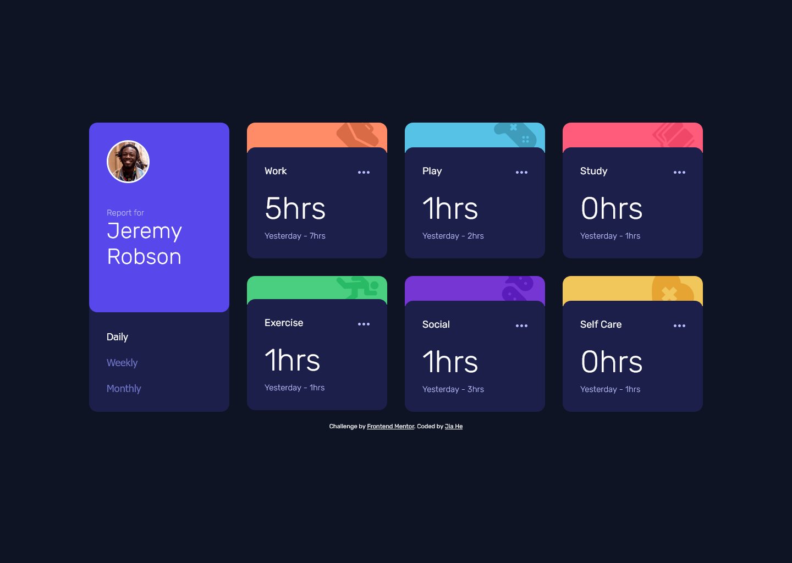

# Frontend Mentor - Time tracking dashboard solution

This is my solution to the [Time tracking dashboard challenge on Frontend Mentor](https://www.frontendmentor.io/challenges/time-tracking-dashboard-UIQ7167Jw). Frontend Mentor challenges help you improve your coding skills by building realistic projects.

## Table of contents

- [Overview](#overview)
  - [The challenge](#the-challenge)
  - [Screenshot](#screenshot)
  - [Links](#links)
- [My process](#my-process)
  - [Built with](#built-with)
  - [What I learned](#what-i-learned)
  - [Continued development](#continued-development)
  - [Useful resources](#useful-resources)
- [Author](#author)

## Overview

### The challenge

Users should be able to:

- View the optimal layout for the site depending on their device's screen size
- See hover states for all interactive elements on the page
- Switch between viewing Daily, Weekly, and Monthly stats

### Screenshot



### Links

- Solution URL: [My solution](https://www.frontendmentor.io/solutions/responsive-page-with-vanilla-js-NStps5A2xl)
- Live Site URL: [Live site URL](https://time-tracking-dashboard-jiiah.netlify.app/)

## My process

### Built with

- Semantic HTML5 markup
- CSS custom properties
- Flexbox
- CSS Grid
- Vanilla JavaScript

### What I learned

Through this project, I strengthened my understanding of both CSS and JavaScript. Below are the key takeaways and some code I’m proud of.

#### CSS Techniques

- I used flex: 1 on the `<figure class="user-info">` element to make it stretch and fill the vertical space of its parent container. This helped align the height of the user section with the other columns in the grid.

#### JavaScript Concepts

- Dynamic Access with Bracket Notation

  In my JSON data, each activity has a timeframes object that includes keys like "daily", "weekly", and "monthly".

  I used timeframes[timeframe] to dynamically access data depending on which button is clicked.

- Event Delegation and Button States

  I added an event listener to the .btn-group container and checked if a .btn was clicked.

  Then, I used .classList to update the btn-active class and fetch the corresponding data.

- Dynamic Content Update

  I looped through each board item and updated the current and previous hours.

  I also added "hr" or "hrs" based on the number for correct grammar.

Here's the code I'm proud of:

```css
.user {
  display: flex;
  flex-direction: column;
}

.user-info {
  flex: 1;
}
```

```js
function updateUI(timeframe, label) {
  const boards = document.querySelectorAll(".board");

  currentData.forEach((item, index) => {
    const current = item.timeframes[timeframe].current;
    const previous = item.timeframes[timeframe].previous;

    const currentEl = boards[index].querySelector(".current-hours");
    const prevTimeframeEl = boards[index].querySelector(".prev-timeframe");
    const prevHoursEl = boards[index].querySelector(".prev-hours");

    const currentSuffix = current <= 1 ? "hr" : "hrs";
    const prevSuffix = previous <= 1 ? "hr" : "hrs";

    currentEl.textContent = `${current}${currentSuffix}`;
    prevTimeframeEl.textContent = label;
    prevHoursEl.textContent = `${previous}${prevSuffix}`;
  });
}

btnGroup.addEventListener("click", (e) => {
  if (!e.target.classList.contains("btn") || !currentData) return;

  btns.forEach((btn) => btn.classList.remove("btn-active"));
  e.target.classList.add("btn-active");

  let timeframe, label;
  if (e.target.classList.contains("daily")) {
    timeframe = "daily";
    label = "Yesterday";
  } else if (e.target.classList.contains("weekly")) {
    timeframe = "weekly";
    label = "Last Week";
  } else if (e.target.classList.contains("monthly")) {
    timeframe = "monthly";
    label = "Last Month";
  }

  updateUI(timeframe, label);
});
```

### Continued development

As I continue to build projects, here are some areas I plan to focus on and improve:

- JavaScript DOM manipulation: Although I used querySelector, forEach, and dynamic class handling in this project, I aim to write cleaner, more reusable functions for updating the UI.

- Code structure and modularity: I plan to refactor my JavaScript into smaller, reusable functions or modules to improve readability and maintainability.

### Useful resources

- [Fetching data from the server](https://developer.mozilla.org/en-US/docs/Learn_web_development/Core/Scripting/Network_requests)

## Author

- Frontend Mentor - [@JiaHe35354](https://www.frontendmentor.io/profile/JiaHe35354)
